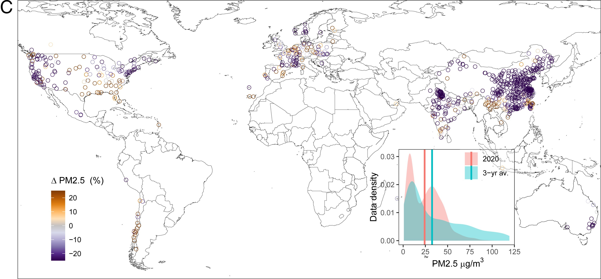
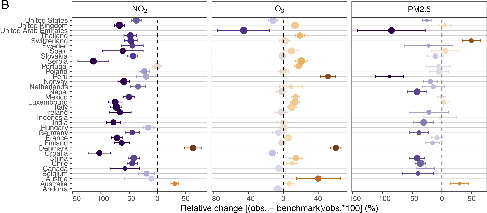

```{r setup, include=FALSE}
library(tidyverse)
library(scales)
library(modelr)

theme_set(theme_bw())

knitr::opts_chunk$set(echo = TRUE)
```

# Description

The goal of this document is to investigate this [article](https://write.geeksforgeeks.org/%5D(https://www.pnas.org/doi/10.1073/pnas.2006853117#sec-1)https://www.pnas.org/doi/10.1073/pnas.2006853117#sec-1) and recreate some of its figures. In the article they mention, "The global response to the COVID-19 pandemic has resulted in unprecedented reductions in economic activity. We find that, after accounting for meteorological variations, lockdown events have reduced the population-weighted concentration of nitrogen dioxide and particulate matter levels by about 60% and 31% in 34 countries, with mixed effects on ozone. Reductions in transportation sector emissions are largely responsible for the NO2 anomalies" (1).

# Loading the data

We joined the city data with the coordinates data, and treat the parameter variable as a factor.

```{r load-data}
city <- read_csv(gzfile('city_day_agg_cleaned.csv.gz'), show_col_types = FALSE)
coords <- read_csv('openaq_cities.csv', show_col_types = FALSE)

# Join city and coords data
city_coords <- left_join(city, coords, by=c('countryCode', 'city_id'))

city['parameter'] <- as.factor(city$parameter)

rename()

head(city)
```

# Fig 1C Density Plot

We added a new column called condition, which is going to differentiate between the baseline(01/01 - 05/15/2017 - 19) and the 2020 COVID19 time frame (01/01 - 05/15/2020) for each city. Then we plot the mean pm25 level for the baseline and 2020 time frame for each city.

```{r fig-1C-inset}
city_condition <- city_coords %>%
  filter(parameter == 'pm25') %>% 
  filter(month(date) %in% c(1, 2, 3, 4) | (month(date) == 5 & day(date) <= 15)) %>% 
  mutate(condition = as.factor(ifelse(year(date) == 2020, '2020', 'baseline'))) 

cities_2020 <- city_condition %>% 
  filter(condition == '2020') %>% 
  select(Lon, Lat, city_id, countryCode) %>%
  unique()

cities_baseline <- city_condition %>% 
  filter(condition == 'baseline') %>% 
  select(Lon, Lat, city_id, countryCode) %>% 
  unique()

cities_common <- inner_join(cities_baseline, cities_2020, by=c('Lon', 'Lat', 'countryCode', 'city_id'))

city_density <- inner_join(city_condition, cities_common, by=c('Lon', 'Lat', 'countryCode', 'city_id')) %>%
  group_by(condition, Lon, Lat, city_id, countryCode) %>% 
  summarise(mean_per_city = mean(mean))

mean_2020 <- city_density %>% filter(condition == '2020')
mean_2020 <- mean(mean_2020$mean_per_city)
mean_baseline <- city_density %>% filter(condition == 'baseline')
mean_baseline <- mean(mean_baseline$mean_per_city)
  
city_density %>% 
  ggplot(aes(x = mean_per_city, color = condition, fill = condition)) +
  geom_density(alpha = 0.5) +
  geom_vline(xintercept = mean_2020, color = 'coral') +
  geom_vline(xintercept = mean_baseline, color = 'turquoise') +
  coord_cartesian(xlim = c(0, 120)) +
  labs(x = 'PM2.5', y = 'Data density', color = '', fill = '')
```

# Fig 1C Map

We computed the mean deviation percentage and used the longitude and latitude of each city to plot them on a world map.

```{r fig-1C-map}
city_wider <- pivot_wider(city_density, names_from = condition, values_from = mean_per_city)
city_wider <- rename(city_wider, c('mean_2020'='2020', 'mean_baseline'='baseline', 'long'='Lon', 'lat'='Lat'))
city_2020_deviation <- city_wider %>%
  mutate(deviation = ((mean_2020 - mean_baseline)/mean_2020)*100) %>% 
  filter(deviation >= -30 & deviation <= 30)

world_map <- map_data("world")
ggplot() +
  geom_polygon(data = world_map, aes(long, lat, group = group), fill = "white", color = "black", lwd = 0.25) +
  coord_cartesian(xlim = c(-115, 145), ylim = c(-55, 70)) +
  geom_point(data = city_2020_deviation, aes(long, lat, color = deviation), pch = 1) +
  scale_color_gradientn(colors = c('#270B4D', 'purple4', '#D0BBF0', 'peachpuff', 'darkorange2', 'darkorange4'), 
                        values = c(0, 1)) +
  labs(color = 'PM2.5 (%)')
```

## Compare to the original figure



While our plots do not exactly match the originals, the article has subtle confusion on how they plotted these graphs and we suspect their are minor bugs in their code.

# Fig 3b Relative Change of USA and Switzerland

Here we use the USA and Switzerland data and compute the difference between the observed benchmark and the predicted benchmark for each.

```{r fig-3B-relative-change}
# Get the baseline data for the US and Switzerland
# Add a column for month and weekday
city_baseline <- city_condition %>% 
  filter(condition == 'baseline') %>%  
  filter(country == 'US' | country == 'CH') %>% 
  mutate(month = month(date, label=T), weekday = as.factor(weekdays(date, abbreviate=T))) %>% 
  mutate(is_weekday = !(weekday == 'Sun'| weekday == 'Sat'))

# Train a model on the baseline data to predict mean as a function of month and is/is not a weekday
model <- lm(mean ~ month + is_weekday, data = city_baseline)

# Get the data for the US and Switzerland after lockdown (March 16, 2020) 
city_Mar2020 <- city_condition %>% 
  filter(date >= '2020-03-15') %>%  
  filter(country == 'US' | country == 'CH') %>% 
  mutate(month = month(date, label=T), weekday = as.factor(weekdays(date, abbreviate=T))) %>% 
  mutate(is_weekday = !(weekday == 'Sun'| weekday == 'Sat')) %>% 
  add_predictions(model)

# Predict the standard error and add a column to the US and Switzerland lockdown data
pred <- predict(model, city_Mar2020, se.fit=TRUE)
city_Mar2020$se = pred$se.fit

# Calculating the RMSE and R-squared of the model on the US and Switzerland lockdown data
rmse(model, city_Mar2020)
(1-mse(model, city_Mar2020))/var(city_Mar2020$mean)

# Calculate the relative change and confidence intervals per country
# There are two ways to calculate this, and it is unclear which way the article does their calculation
relchange_df <- city_Mar2020  %>%
  group_by(country) %>%
  summarise(obs_mean = mean(mean), pred_mean = mean(pred), se = mean(se*mean)) %>%
  group_by(country, se) %>%
  summarise(relchange = (obs_mean-pred_mean)/obs_mean*100, CI = se*1.96)

relchange_df2 <- city_Mar2020  %>%
  mutate(dev = (mean-pred)/mean*100, se = se*mean) %>%
  group_by(country) %>%
  summarise(relchange = mean(dev), CI = mean(se)*1.96)

# Plot the relative change and confidence intervals per country (df1)
ggplot(data = relchange_df, aes(x = relchange, y = country, color = relchange)) +
  geom_point() +
  geom_vline(xintercept = 0, linetype = 'dashed') +
  scale_color_gradientn(colors = c('purple4', 'white', 'darkorange2'), values = c(0, 1)) +
  coord_cartesian(xlim = c(-80, 80)) +
  geom_errorbarh(aes(xmin = relchange-CI, xmax = relchange+CI))

# Plot the relative change and confidence intervals per country (df2)
ggplot(data = relchange_df2, aes(x = relchange, y = country, color = relchange)) +
  geom_point() +
  geom_vline(xintercept = 0, linetype = 'dashed') +
  scale_color_gradientn(colors = c('purple4', 'white', 'darkorange2'), values = c(0, 1)) +
  coord_cartesian(xlim = c(-80, 80)) +
  geom_errorbarh(aes(xmin = relchange-CI, xmax = relchange+CI), height = 0.25)
```

## Compare to the original figure



# Future Questions
